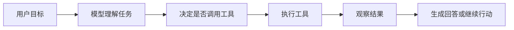

# Day 1 - AI Agent工程师能力地图

## 今日目标

建立 AI Agent 应用开发的整体地图，理解模型、指令、工具、状态、工作流和评估之间的关系。

今天不追求把所有技术细节学完，重点是能用自己的话回答：**一个 AI Agent 系统由哪些关键模块组成，AI 应用工程师到底在工程上负责什么。**

## 今日学习资料

- [OpenAI Agents Guide](https://platform.openai.com/docs/guides/agents)
- [OpenAI Practical Guide to Building Agents](https://cdn.openai.com/business-guides-and-resources/a-practical-guide-to-building-agents.pdf)
- [[AI Agent工程师3个月学习计划]]

## 1小时学习安排

| 时间 | 任务 | 产出 |
|------|------|------|
| 10 分钟 | 阅读 OpenAI Agents Guide，关注 agent 的组成部分 | 标出关键词 |
| 20 分钟 | 阅读 Practical Guide 前半部分，理解 agent/workflow 适用场景 | 写下 3 个概念 |
| 20 分钟 | 整理 AI 应用工程师能力地图 | 完成本笔记主体 |
| 10 分钟 | 复盘今天疑问，并准备明天 API 调用 | 明日 checklist |

## AI Agent 是什么

AI Agent 可以理解为一个能围绕目标自主推进任务的 AI 系统。它不只是生成一段回答，而是可以根据上下文决定下一步行动，调用工具，观察结果，再继续调整行动。

一个简化版 agent 循环是：



## Agent 和 Chatbot 的区别

| 维度 | 普通 Chatbot | AI Agent |
|------|--------------|----------|
| 主要目标 | 回答问题 | 完成任务 |
| 行动能力 | 通常只生成文本 | 可以调用工具、检索资料、执行步骤 |
| 状态管理 | 多轮上下文为主 | 需要显式管理任务状态、工具结果和中间步骤 |
| 工程重点 | Prompt 和对话体验 | 工具设计、流程控制、评估、权限和可观测性 |
| 风险点 | 幻觉、答非所问 | 错误调用工具、权限越界、循环失控、成本失控 |

## Agent 系统的核心模块

### Model

模型负责理解任务、推理、生成回复，并在需要时决定调用工具。工程上要关注模型能力、上下文长度、成本、延迟和稳定性。

### Instructions

Instructions 是 agent 的行为边界，决定它应该扮演什么角色、遵守什么约束、如何处理不确定性、什么时候拒答或请求人工确认。

### Tools

Tools 是 agent 连接外部世界的接口，例如搜索知识库、读取文件、运行 SQL、调用 API、生成报告。工具设计要清晰、窄口径、可校验。

### State / Memory

State 记录任务过程中的上下文，例如用户目标、已调用工具、当前步骤、检索到的证据、错误信息和待确认操作。没有状态管理，复杂任务很容易丢上下文或重复执行。

### Workflow

Workflow 定义 agent 如何推进任务。简单场景可以用固定流程，复杂场景可以用 LangGraph 这类状态图控制分支、循环、暂停和人工确认。

### Evaluation

Evaluation 用来判断 agent 是否真的有效。AI 应用不能只靠“看起来回答不错”，需要准备测试问题、标准答案、引用来源检查、失败案例和回归测试。

### Observability

Observability 让工程师知道 agent 每一步做了什么，包括模型输入输出、工具调用、耗时、token 消耗、错误和最终结果。没有可观测性，就很难调试和优化。

## AI 应用工程师需要掌握什么

- LLM API 调用：请求、响应、流式输出、结构化输出
- Prompt / Instructions：明确角色、约束、输出格式和拒答策略
- Tool Calling：设计工具 schema、参数校验、错误处理和结果总结
- RAG：文档切分、embedding、检索、引用来源和拒绝编造
- Agent Workflow：任务拆解、状态管理、循环控制、人工确认
- MCP：把本地文件、数据库、内部系统封装为标准工具
- Evaluation：构建测试集，持续检查准确性、引用质量和稳定性
- Deployment：配置管理、日志、成本控制、权限控制和监控

## 我想做的最终作品

初步方向：**个人知识库 + 数据分析 Agent**。

它应该能完成：

- 读取 Obsidian Markdown 知识库
- 根据问题检索相关笔记并引用来源
- 必要时调用 SQL 或本地数据分析工具
- 生成结构化 Markdown 报告
- 对写文件、执行查询等高风险操作请求人工确认
- 记录 trace，能复盘每一步为什么这么做

## 今日收获

- Agent 的核心不是“更会聊天”，而是“围绕目标调用工具并推进任务”。
- 对工程师来说，关键能力不只是 prompt，而是工具边界、状态管理、评估和可观测性。
- 复杂多 agent 不是起点，先把单 agent 和固定 workflow 做稳定更重要。

## 今日疑问

- Responses API、Agents SDK、LangGraph 三者在实际项目中如何取舍？
- 工具调用失败时，应该让模型自己重试，还是由代码层控制重试？
- RAG 的引用质量应该如何自动评估？

## 明日准备

明天目标：跑通第一个最小 Python API 调用，完成 `hello_llm.py`。

- [ ] 确认 Python 环境可用
- [ ] 确认 OpenAI API key 配置方式
- [ ] 新建一个最小脚本，向模型发送一句话并打印回答
- [ ] 记录请求参数、响应结构和错误处理方式

## 实操 1：第一个 Demo Agent

### 任务

创建一个 OpenAI Agents SDK demo agent，并给它一个本地只读工具，用来扫描 Vault 中最近 7 天更新过的文档。

### 文件位置

- 代码目录：`code/`
- Agent 脚本：`code/recent_docs_agent.py`
- 依赖文件：`code/requirements.txt`
- 环境变量示例：`code/.env.example`

### 工具行为

工具只读取文件元数据：

- 相对路径
- 修改时间
- 文件大小
- 文件扩展名

工具不会读取文档正文内容，并跳过 `.git/`、`.obsidian/`、`.trash/`、`.cache/` 等目录。

### 运行记录

- [x] 安装依赖：`uv venv && uv pip install -r requirements.txt`
- [x] 本地扫描工具验证：`uv run python recent_docs_agent.py --scan-only --limit 50`
- [x] Python 语法检查：`uv run python -m py_compile recent_docs_agent.py`
- [x] DeepSeek 真正运行 agent：`uv run python recent_docs_agent.py --limit 20`

### 当前阻塞

DeepSeek 已跑通。当前仅有一个非阻塞提示：OpenAI tracing 因为没有 `OPENAI_API_KEY` 会跳过 trace export，不影响 DeepSeek agent 调用和工具执行。

后续如果要重新运行，可以复制 `code/.env.example` 为 `code/.env` 并填写本地 key，再运行：

```bash
uv run python recent_docs_agent.py
```

DeepSeek 配置示例：

```env
AGENT_PROVIDER=deepseek
DEEPSEEK_API_KEY=sk-your-deepseek-api-key
DEEPSEEK_BASE_URL=https://api.deepseek.com
AGENT_MODEL=deepseek-chat
```

### 本地扫描结果摘要

本地工具已成功扫描，最近 7 天共找到 62 个文档。由于 `--limit 50`，本次输出返回前 50 个。

DeepSeek agent 实际运行时使用 `--limit 20`，返回了 20 个最近更新文档，并说明总计 62 个。
