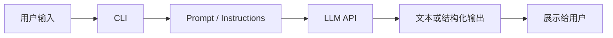

# Day 7 - 第1周复盘

## 今日任务

整理第 1 周学习内容：API、prompt、结构化输出和 CLI 助手之间的关系。

## 学习资料

- [OpenAI Practical Guide to Building Agents](https://cdn.openai.com/business-guides-and-resources/a-practical-guide-to-building-agents.pdf)
- [[AI Agent工程师3个月学习计划]]
- [[Day 1 - AI Agent工程师能力地图]]
- [[Day 2 - 跑通第一个LLM API调用]]
- [[Day 3 - Prompt基础与输出约束]]
- [[Day 4 - 结构化输出与JSON Schema]]
- [[Day 5 - 命令行问答助手]]
- [[Day 6 - 可配置的CLI助手]]

## 1小时安排

| 时间 | 任务 | 完成情况 |
|------|------|----------|
| 15 分钟 | 回顾 Day 1 到 Day 6 的笔记 |  |
| 20 分钟 | 整理本周代码产出和关键概念 |  |
| 15 分钟 | 画出 API、prompt、schema、CLI 的关系 |  |
| 10 分钟 | 写下第 2 周工具调用学习问题 |  |

## 本周产出清单

- [ ] `hello_llm.py`
- [ ] 3 组 prompt 对比
- [ ] JSON schema 输出实验
- [ ] `cli_assistant.py`
- [ ] 可配置 CLI 助手

## 本周核心概念

| 概念 | 我自己的理解 | 还不清楚的地方 |
|------|--------------|----------------|
| LLM API |  |  |
| Prompt |  |  |
| Structured Outputs |  |  |
| CLI Assistant |  |  |
| System Prompt |  |  |

## 本周关系图

## 我已经掌握的

- 

## 还需要补的

- 

## 第2周想重点解决的问题

- 

## 下周准备

下周主题：Function Calling 与工具调用。

- [ ] 阅读 Function Calling 文档
- [ ] 思考哪些本地能力适合封装成 tool
- [ ] 准备 mock tool：天气、时间、计算器

